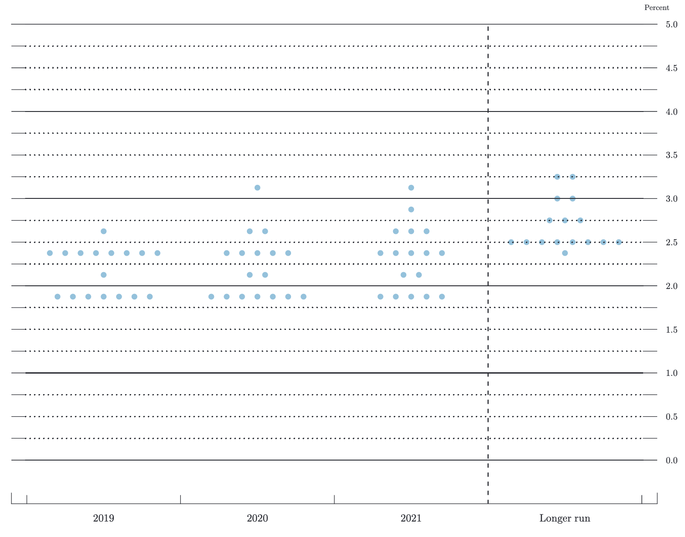

# Monetary Futarchy

Polkadot does not have a predefined issuance schedule by design. Once the network launches and achieves relative stability, it will be necessary to communicate clear expectations for the future issuance schedule to stakeholders. This module uses a designated committee to relay expectations of future changes akin to Central Bank [forward guidance](https://www.federalreserve.gov/faqs/what-is-forward-guidance-how-is-it-used-in-the-federal-reserve-monetary-policy.htm).

> **NOTE**: whenever I talk about *dilution* to the Treasury, just replace "`dilution`" with "`silent tax on liquid DOTs`", redistributed to the powers that control the treasury (ie the benevolence or corruptness of the treasury's governance). If that governance is opaque and centralized, then we just created a digital version of the existing, broken monetary governance systems.

## Understanding the Polkadot Treasury

The original purpose of the [treasury](https://www.federalreserve.gov/faqs/what-is-forward-guidance-how-is-it-used-in-the-federal-reserve-monetary-policy.htm) is to keep the proportion of tokens staked constant while minting liquid validator rewards. **Why?** The proportion of liquid supply determines how cheap/easy it is to overcome the BFT threshold (1/3) and attack the blockchain...I don't really buy the argument that it aligns the token value with network security (see PoW) **How?** [`OnDilution`](https://github.com/paritytech/substrate/blob/master/srml/treasury/src/lib.rs#L339) runtime hook "mints extra funds for the treasury to keep the ratio of `tokens_staked` to `total_issuance` equal pre-dilution and post-dilution".

So, the treasury exists to provide some control over the **`locked : liquid`** ratio. 
* Too much liquidity implies vulnerability to outside attacks, especially during the initial launch (at which point the total market cap will optimistically total a few billion USD, less than many nations and corporations)
* Too little liquidity will negatively impact price discovery `=>` more volatility (and potential price manipulation)

At the network's launch, the treasury will generously dilute rewards. For every block author reward, four times that amount is sent to the treasury. Eventually, this kind of aggressive dilution won't be necessary. *Who will determine when that is and how will it be coordinated and enforced through governance?*

**The purpose of this project is to raise awareness of the treasury's governance and its significant influence on ecosystem development**. The treasury is fed by Polkadot's dilution mechanism. In practice, this mechanism extracts a silent tax on liquid DOTs; this tax is redistributed to the treasury and validators/nominators in the form of minted rewards. This is an example of the [Cantillon Effect](https://www.aier.org/article/sound-money-project/cantillon-effects-and-money-neutrality) in which the first to receive new funds benefit disproportionately. 

> If this isn't immediately clear, consider the following example. I issue five beads and back all of the beads by $10. So you might reason that each bead is worth $2 (*assuming there was a market*). If I issue five more beads, but don't increase the amount that backs the beads, you would reason that each bead is worth $1. This is basically how inflation works, but it doesn't happen all at once. It happens slowly over time because prices adjust slowly over time. So the first to spend the new funds are spending in a market that is treating each bead as if it is worth $2. Eventually, prices adjust and somewhere down the line, each bead is worth $1.

So, the takeaway is that issuance redistributes wealth `=>` DOT holders really need to pay attention to the structure of Polkadot's monetary policy. Moreover, the initial issuance schedule, which conservatively dilutes significant DOTs into the treasury, should not be enforced indefinitely. **([1](#futarchy)) How will changes be made to this issuance schedule and what kind of mechanisms are in place to prevent (or expensively price) radical changes?**

Moreover, **([2](#treasury)) once significant dilution is channeled to the treasury, who will manage those funds?** The value accumulated in the treasury represents part of the silent tax on liquid DOT holders -- these stakeholders must have a say in how it is spent! 

## Proposal

So, basically I want to introduce a council tasked with
1. forward guidance on issuance and spending decisions
2. fund management of the treasury

Different stakeholders have different perceptions of the DOT token's purpose. VCs might prefer less dilution to the treasury in a low price scenario, while Parity presumably would prioritize chain security to short-term token valuation. Without clear consensus on the token's purpose, conflicts of interest are bound to arise `=>`Polkadot needs a monetary council to govern monetary policy. This follows from the fact that the ecosystem contains a diverse set of stakeholders with strong opposing opinions on token purpose.

The monetary council will represent Polkadot's stakeholders with domain-specific experts selected by DOT holders via Phragmen's algorithm (like all other councils). This council should significantly bias low voter turnout, with the expectations that DOT holders will probably delegate most decisions to the domain-specific experts on the council. 

The process for pitching an investment will also be open to the public. To prevent proposal spam, I am thinking it might be appropriate to require significantly more collateral from normal (not-on-council) DOT holders for council-relevant proposals. Members of the council can cheaply propose changes that are voted on, while normal DOT holders must either gain the sponsorship of a council member OR crowdfund collateral from other DOT holders to trigger a referendum. This ensures most proposals that are voted on are from council members, but it also provides a path for disgruntled DOT holders to instigate change without the support of the council. In other words, it prevents DOT holders from being pushed out of governance, but still delegates responsibility in the optimistic setting to the council.

If the council was hypothetically *captured* and attempted to vote maliciously, the DOT holders could easily reject the proposal in the referendum. If the *captured council* refused to act in the face of some market calamity, the DOT holders can still crowdfund a proposal above the required threshold to trigger a referendum in which case a high DOT turnout would still guarantee passage. This is a nice balance of power that facilitates delegation of opinion in optimistic scenarios without sacrificing future governance power.

## Monetary Futarchy <a name = "futarchy"></a>
> This is heavily inspired by [forward guidance](https://www.bloomberg.com/quicktake/forward-guidance) -- similarly, it does not need to be binding.

The monetary policy council might present a DOT plot which predicts inflation (defined as how many new coins will be minted) for the next `x` periods. For context, the Fed does this with interest rates and calls it the DOT plot!



At first, there does not need to be any consequence to these projections. They are a way of relaying expectations in a transparent way. If nothing else, this exercise encourages relative stability by psychologically anchoring future decisions to these projections.

### Projection Schema

There are basically a few different ways that funds are diluted to the treasury at Polkadot's initial launch:
1. 80% of the block reward goes to the treasury and 20% to the block author
2. 100% of validator rewards are matched and sent to the treasury
3. some % of parachain rewards might be matched as dilution to the treasury

For context on (3), parachain validation rewards will initially be set to 0 in the absence of parachains but they will eventually encompass 90% of validator rewards.

The exact parameterizations aren't set in stone, but these three dilution streams form the basis for the `Projection` struct defined in the (current) runtime for tracking projections and how projections change over time. Governance of these parameters needs to be more explicit, but the current design over-optimizes for readability for demonstration purposes (see expected architecture detailed further blow). 

```rust
type DotPoint: Vec<(BalanceOf, BlockNumber)>;

#[derive(Encode, Decode, Clone, Eq)]
#[cfg_attr(feature = "std", derive(Debug))]
pub struct Projection<DotPoints> {
    // projections for total reward 
    total_reward: DotPoints,
    // dilution to treasury on block author reward
    treasury_dilute_on_block_author:  DotPoints,
    // block author reward
    block_author_reward: DotPoints,
    // dilution to treasury on relay chain validator reward
    treasury_dilute_on_relay_reward: DotPoints,
    // relay chain validator reward
    validator_relay_reward: DotPoints,
    // dilution to treasury on parachain rewards
    treasury_dilute_on_parachain_reward: DotPoints,
    // parachain rewards (eventually to be highest)
    validator_parachain_rewards: DotPoints,
}
```

#### <a href="">Actual Expected Runtime Storage of Projections</a>

### Radical Change should be Expensive

If we wanted to take things a step further, it would be possible to set the collateral requirement for monetary governance proposals in proportion to the difference between the proposal and the council's projections (might be measured via standard deviation). More specifically, radical proposals that veer from the current council projection path require significantly more collateral than proposals that only slightly tweak the existing schedule. 

## Treasury Fund Management <a name = "treasury"></a>

**The treasury should hold assets with varying degrees of liquidity (liquid to DOT tokens)**. At the network's launch, almost all of the treasury's assets should be in DOTs and this should be the case for a while, but eventually the treasury could diversify into less liquid assets. [Probably not publicly traded assets, but maybe early-stage private investments in the ecosystem](./RISK.md#conclusion).

This could also involve burning DOTs if the network's stakeholders decide they want to take back some of the silent tax that was extracted from the liquid supply.

Lending is probably the most obvious option aside from hodling or burning DOTs. I wouldn't be all that surprised if the system started to look a lot like the existing monetary system. The relay chain's treasury offers low rates to parachains which offer slightly higher interest rates to apps/users. The treasury could adjust rates to constrain/liberate liquidity of DOTs based on the ecosystem's economic conditions. 

### Who/what will be "Too Big To Fail" next time?

In the event of a near market collapse (think Great Recession-esque), the treasury might *in best faith* rescue core infrastructure ie para{chains, threads} deemed "critical". Maybe we are bound to repeat our mistakes `=>` captured governance protects special interests, labeling those that took the most risk and have the least to lose as "Too Big To Fail". 

It's our job to ensure that the governance of this ecosystem is robust against misuse. Our hope is that better designed governance mechanisms will effectively prioritize stakeholder interests when resources are scarce for catching a falling knife.

### staking derivatives will add complexity

Another thing to consider is the liquidity of the funds staked by validators. If the funds are indefinitely locked up, they'll probably be used in a derivatives market soon enough. There will probably also be validator insurance markets. All of these markets will be open to all DOT holders, thereby adding complexity to an already very complicated system. Side (*synthetic*) bets subsidize the underlying, but also increase systemic risk.